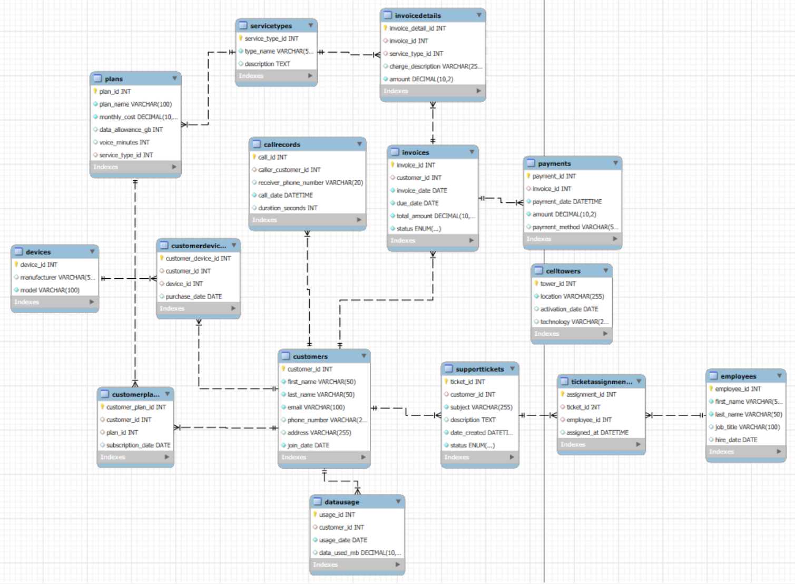

# Project Name: Telecommunications Provider Database System

The telecommunications sector was selected for this project because of its inherent complexity and data-intensive nature, making it ideal for explaining the robust relational database design. This industry is characterized by high transaction volumes, a range of service offerings, and the continuous generation of massive datasets from network activity, billings and plan usages. A typical provider must manage an amount of data, including customer profiles, service plans, billing cycles, real-time network usage, device inventories, and ongoing customer support interactions.

## Entity-Relationship Diagram (ERD)

The ERD below illustrates the structure of the database.

## Database Schema

The database schema for this project is defined in the `TelecomDb.sql` file. You can create the database and its tables by running this file.

[View SQL Schema File](TelecomDb.sql)
